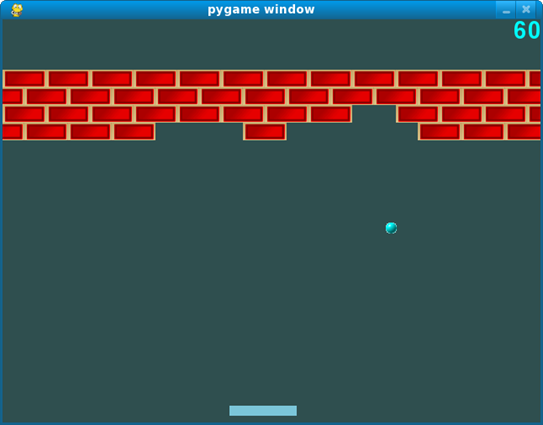

# **SWE4-Übungen - SS2024 - Übungszettel 1**

## **MiniBreakout (`src/breakout`)**

Breakout ist ein absoluter Klassiker unter den Videospielen, der Mitte der
Siebzigerjahre von Atari entwickelt wurde. Das zugrundeliegende Spielkonzept ist
ganz einfach. Der Spielende hat die Kontrolle über einen Schläger, mit dem er
versuchen muss, einen Ball so lange wie möglich im Spiel zu halten. Mit dem Ball
kann er Ziegel aus einer Mauer schießen. Für jeden abgeschossenen Ball bekommt
er Punkte gutgeschrieben. Die Wertigkeit der Ziegel kann unterschiedlich sein.
Mit Fortdauer des Spiels steigert sich der Schwierigkeitsgrad, da die
Geschwindigkeit des Balls zunimmt.

<div align="center">
  
</div>

Ihre Aufgabe ist es nun, unter *möglichst weitreichendem Einsatz* der MiniLib
(Grafikklassen, Behälterbibliothek) einen einfachen Breakout-Klon zu
entwickeln, der zumindest folgende Anforderungen erfüllt: 

*	Der Spielende kann den Schläger mit Maus und Tastatur bewegen. 

*	Der Austrittswinkel des Balls hängt von seinem Eintrittswinkel und der
Position, an dem der Ball den Schläger berührt hat ab. 

*	Die Mauer besteht aus mehreren Reihen von Ziegeln. Die Wertigkeit der Ziegel
(wie viele Punkte der Spielende für das Abschießen des Ziegels bekommt) wird
dargestellt (farbkodiert oder in Form einer Beschriftung).

*	Der aktuelle Spielstand wird angezeigt und laufend aktualisiert. 

*	Über ein Menü können verschieden Konfigurationsparameter eingestellt werden
(initiale Ballgeschwindigkeit, Größe des Schlägers, Parameter, die den Aufbau
der Mauer beschreiben etc.).

Sie dürfen bei der Realisierung des Spiels Ihrer Fantasie aber freien Lauf
lassen und können es optional mit zusätzlicher Funktionalität und
Spezialeffekten anreichern. Hier nur einige Anregungen dazu. Die MiniLib baut
auf dem Framework *wxWidgets* auf, welches eine breite Palette an
Grafikoperationen zur Verfügung stellt. So ist es relativ einfach möglich,
Bilder, die in gängigen Bildformaten vorliegen, in ein Fester zu zeichnen:

```cpp
// bei der Initialisierung der Anwendung		
wxImage::AddHandler(new wxPNGHandler);
wxImage brick_image;
brick_image.LoadFile(wxT(".\\images\\brick.png"), wxBITMAP_TYPE_PNG);
brick_image.Rescale(width, height);
// in on_paint		
auto &context = event.get_context();
context.DrawBitmap(brick_image, position);
// beim Beenden der Anwendung
wxImage::CleanUpHandlers();
```

*wxWidgets* enthält auch Funktionalität zum Abspielen von Sounds (`wxSound`). Mit
Bildern und Sounds lässt sich die Qualität Ihres Spiels natürlich wesentlich
steigern. Sie können aber auch an der Spiellogik feilen. Beispielsweise können
Sie mehrere Spielebenen mit unterschiedlichen Mauern realisieren. Der Spielende
kann mehrere Leben haben. Ziegel können mit Spezialeffekten ausgestattet werden:
Joker mit Bonuspunkten, Verdoppelung der Punkte über eine gewisse Zeitspanne
hinweg, Erzeugung zusätzlicher Bälle, die zusätzlich ins Spiel gebracht werden
etc.

### Integration der *Minilib*

* Kopieren Sie die den Übungen verwendeten Verzeichnisse `ml5` und `vcpkg` in
das Wurzelvereichnis Ihrer Lösung. Die Verzeichnisstruktur sollte folgendermaßen
aussehen:

  ```
  |--src/
  |  |--breakout/
  |  |  |--src/
  |  |--CmakeLists.txt
  |--ml5/
  |--vcpgk
  |--run-cmake.bat
  ```

* Erzeugen Sie die Build-Dateien mit `run-cmake.bat`.
* Sollten sich die Verzeichnisse `ml5` und `vcpkg` an einer anderen Stelle
  befinden, können Sie die entsprechenden Pfade mit den Umgebungsvariablen
  `%MINILIB_DIR%` und `%MINILIB_VCPKG_DIR%` definieren. Das wird Ihnen unter
  Umständen beim Erstellen der Review hilfreich sein.
* Checken Sie *keinesfalls* die Verzeichnisse `ml5` und `vcpkg` ein!